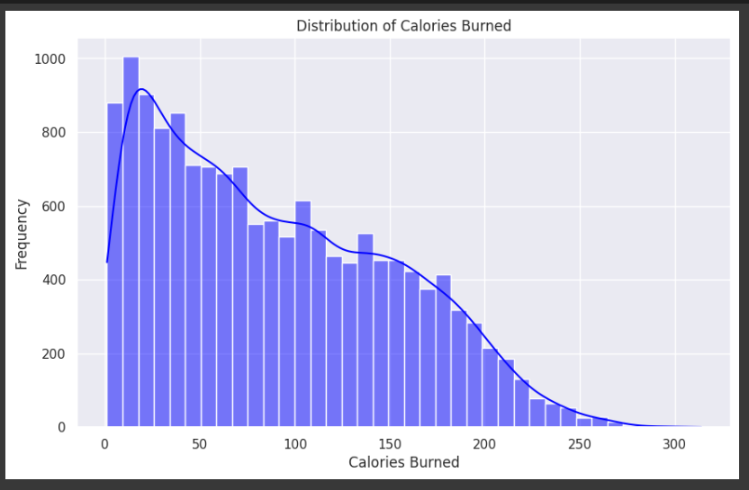
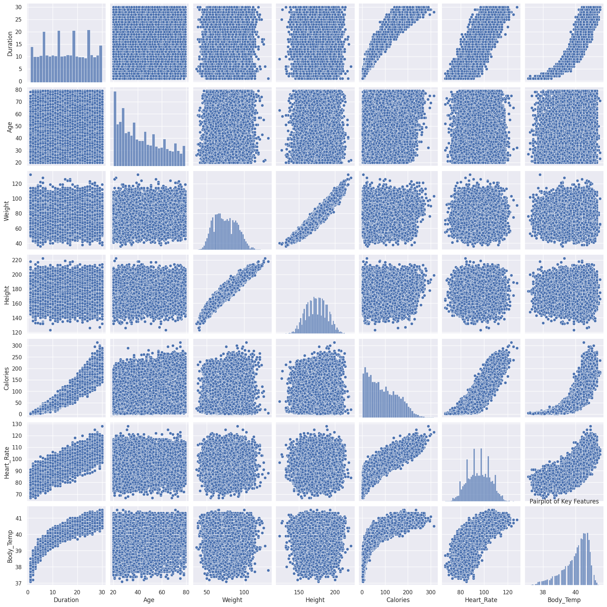
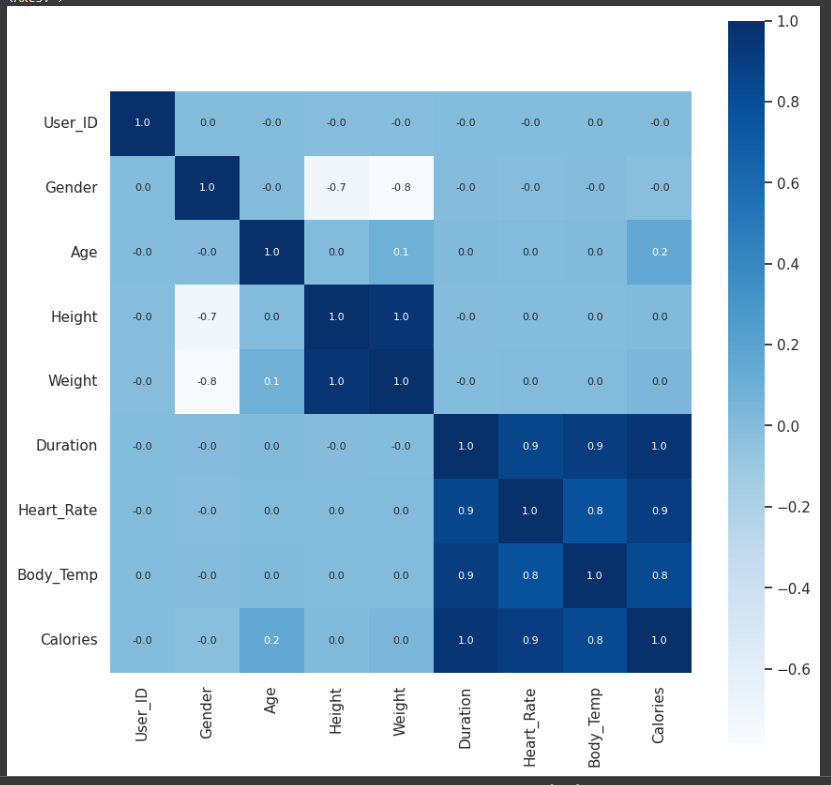
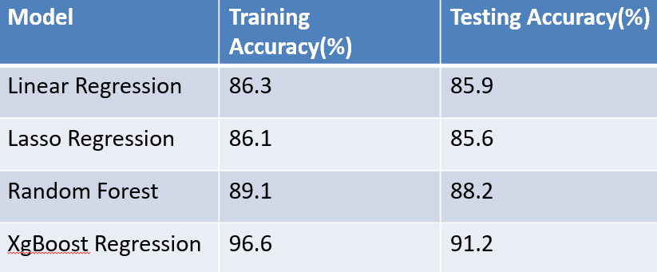
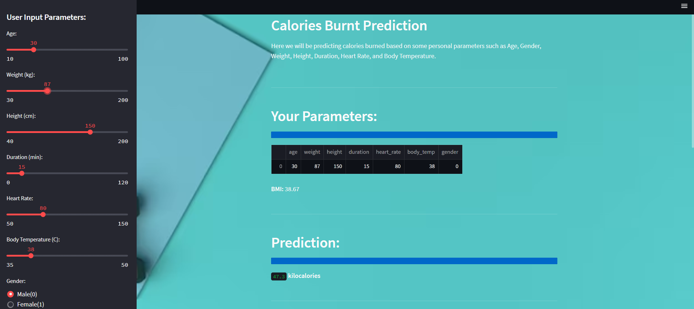
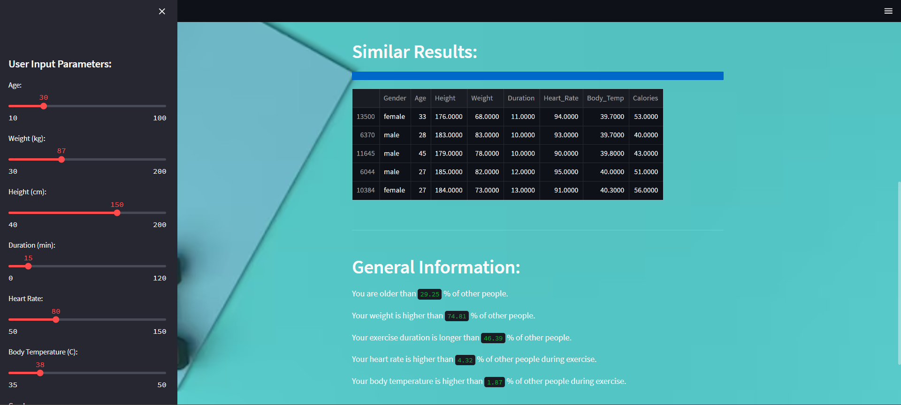

# 1.Project Title: Calories Burnt Prediction

- *Author Name:* Teja Sanaka
- *Semester:* Fall'24
- *Prepared for:* UMBC Data Science Master's Degree Capstone by Dr. Chaojie (Jay) Wang
- *GitHub:* [https://github.com/Teja-Sanaka/UMBC-DATA606-Capstone](https://github.com/Teja-Sanaka/UMBC-DATA606-Capstone)
- *LinkedIn profile:* [https://www.linkedin.com/in/teja-sanaka-6598771ba/](https://www.linkedin.com/in/teja-sanaka-6598771ba/)
- *[YouTube Video]:*(https://youtu.be/yBLU3z5dSaA?si=5AUmnlWZJDM0vdY2)
- *[PowerPoint Presentation]:*(/teja_ppt.pptx) 

# 2.Background

**What is the project about?**

This project is about predicting how many calories are burned during exercise based on factors like how long the exercise lasts, what kind of exercise it is, and personal details like age, weight, and gender. The goal is to use machine learning to better understand how these factors affect calorie burning.

**Why is it important?**

Knowing how many calories are burned is important for staying healthy, managing weight, and improving fitness. Many people want to meet their fitness goals, whether it's losing weight, building muscle, or staying healthy. Accurately predicting calorie burn helps people customize their exercise plans, eat better, and improve their training.

This research can also be useful for fitness trainers, individuals, and companies that create fitness devices or apps. Better calorie predictions can help them give better advice for reaching health goals.

**What questions are we trying to answer?**

1. **What are the most important factors that affect calorie burning during exercise?**

2. **- Can we accurately predict calories burnt using exercise and personal data?**
    
3. **Which machine learning model is best for predicting calorie burn?**

# 3.Data

**Datasets**

The datasets used in this project focus on exercise data and calorie expenditure. These datasets will help answer research questions about predicting calorie burn during different types of physical activities.

- **Data Sources**: The datasets include "exercise.csv" and "calories.csv" files, which provide the necessary information for building a calorie prediction model based on exercise details.
  
- **Data Size**: 
  - **exercise.csv**: [662 KB]
  - **calories.csv**: [225 KB]
  
- **Data Shape**: 
  - **exercise.csv**: 15000 rows and 8 columns
  - **calories.csv**: 15000 rows and 2 columns

- **Time Period**: The datasets do not include explicit time-bound data.

- **Each Row Represents**: 
  - Each row likely represents a single exercise session or activity, performed by an individual participant, with details such as exercise duration, participant characteristics, and the corresponding calories burned.

**Data Dictionary**:  
The table below outlines the columns, data types, definitions, and potential values in the datasets.

| **Column Name**       | **Data Type**  | **Definition**                                      | **Potential Values**                 |
|-----------------------|----------------|----------------------------------------------------|--------------------------------------|
| **Duration (mins)**    | Numerical      | The duration of the exercise session in minutes     | Numeric values (e.g., 30, 60, etc.) |
| **Age**               | Numerical      | The age of the participant                          | Numeric values (e.g., 25, 40, etc.) |
| **Weight (kg)**        | Numerical      | The weight of the participant in kilograms          | Numeric values (e.g., 70, 85, etc.) |
| **Height (cm)**        | Numerical      | The height of the participant in centimeters        | Numeric values                      |
| **Gender**            | Categorical    | Gender of the participant                           | Male, Female                        |
| **Calories Burned**   | Numerical      | The number of calories burned after the exercise   | Numeric values (target variable)    |
| **Body Temperature**   | Numerical      | The body temperature after the exercise   | Numeric values     |
| **Heart rate**   | Numerical      | The heart rate after the exercise   | Numeric values     |

**Target/Label**:
- **Target Variable**: The target variable in the machine learning model will be **"Calories Burned"**. This is the output the model will predict based on the input features.

**Features/Predictors**:
- The following columns may be selected as features/predictors in the machine learning model:
  - **Duration (mins)**
  - **Age**
  - **Weight (kg)**
  - **Height (cm)**
  - **Gender**

These features will help the model learn the relationship between exercise activities and the number of calories burned.

**Dataset Details**:

- **calories.csv**:
  - **Shape**: 15,000 rows and 2 columns
  - **Columns**: 
    - **User_ID**: Unique identifier for the participant
    - **Calories**: The number of calories burned during the exercise session (target variable)

- **exercise.csv**:
  - **Shape**: 15,000 rows and 8 columns
  - **Columns**:
    - **User_ID**: Unique identifier for the participant
    - **Gender**: Gender of the participant (categorical: Male, Female)
    - **Age**: Age of the participant (numerical)
    - **Height**: Height of the participant in centimeters (numerical)
    - **Weight**: Weight of the participant in kilograms (numerical)
    - **Duration**: Duration of the exercise session in minutes (numerical)
    - **Heart_Rate**: Participant's heart rate after the exercise (numerical)
    - **Body_Temp**: Participant's body temperature after the exercise (numerical)


 **Data Preprocessing**:
- Merging the `calories.csv` and `exercise.csv` datasets based on the `User_ID`.
- Encoding categorical variables (`Gender`), and scaling numerical features for consistency in model training.
  
---

# 4. Exploratory Data Analysis (EDA)

### a. **Distribution of Calories Burnt**:
A histogram to visualize the distribution of the target variable, `Calories`. This plot shows whether the calories burnt are normally distributed or skewed.



### b. **Pairplot**:
This helps us to visualize the distribution of every attribute with the other


### c. **Correlation Matrix**:
A heatmap of correlations between variables helps identify which features are most strongly related to the target variable (`Calories`). Features with high correlation, such as `Duration` and `Heart_Rate`, are expected to play a significant role in prediction.




# 5. Model Training
**Models Used:**  
- Linear Regression  
- Lasso Regression  
- Random Forest  
- XGBoost  

**Training Approach:**  
- Split data into 80% training and 20% testing.  
- Used cross-validation for parameter tuning.
  Before building machine learning models, the dataset is split into training and testing sets. Typically, an 80-20 split is used, where 80% of the data is used for training the model and 20% is held back for testing the model's performance.

```python
from sklearn.model_selection import train_test_split

# Define the features (X) and the target variable (y)
X = data.drop(columns=["Calories"])  # Assuming 'Calories' is the target column
y = data["Calories"]

# Split the data into training and testing sets (80% train, 20% test)
X_train, X_test, y_train, y_test = train_test_split(X, y, test_size=0.2, random_state=42)

# Display the shape of the training and testing sets
print(f"Training set shape: {X_train.shape}")
print(f"Testing set shape: {X_test.shape}")
```

---

**Python Libraries:**  
- `pandas`, `numpy`: Data preprocessing.  
- `scikit-learn`: Model building and evaluation.  
- `xgboost`: Model training.  

**Development Environments:**  
- Google Colab and Jupyter Notebook.  

**Performance Metrics:**  
- XGBoost provided the best accuracy, handling feature interactions effectively.  
  
---

# 6. Application of the Trained Models
**Web App**: Built using Streamlit.  


**Features:**  
1. **Calorie Burn Prediction**: Users input personal details to receive predictions.  
2. **BMI Calculation**: Computes BMI based on user-provided weight and height.  
3. **Insights**: Compares user predictions with similar data points for better understanding.  


**Advantages:**  
- Intuitive user interface.  
- Real-time predictions with visual feedback.  

---

# 7. Conclusion
**Achievements:**  
- Developed a functional calorie prediction app using XGBoost and Streamlit.  
- Delivered a user-friendly interface to make predictions accessible.  

**Limitations:**  
- Dataset diversity is limited.  
- Model accuracy may vary for underrepresented groups.  

**Future Directions:**  
- Incorporate advanced models like neural networks.  
- Expand datasets with more varied demographic and activity data.  
- Integrate real-time wearable device data for enhanced predictions.  

---

# 8. References
- Kaggle Datasets: [Exercise and Calories](https://www.kaggle.com/datasets)  
- Python Libraries Documentation: `scikit-learn`, `xgboost`, `streamlit`  
- Academic Papers and Blogs on Feature Engineering and Predictive Modeling.  


