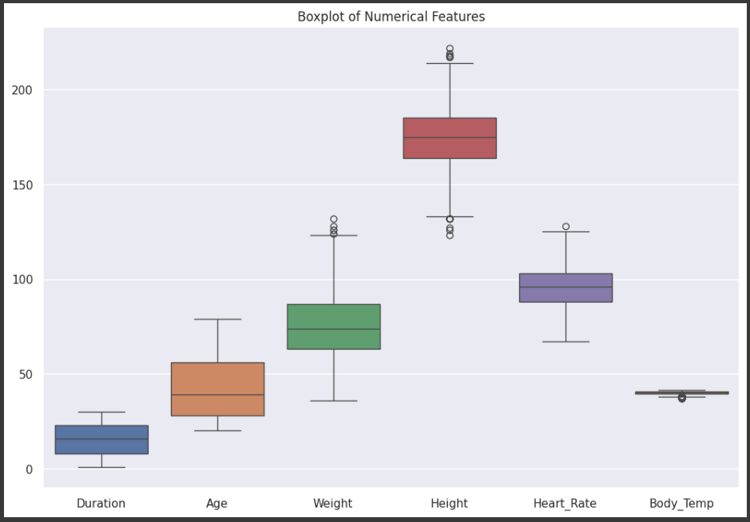

# Calories Burnt Prediction - Machine Learning Project

## 1. Problem Overview
The objective of this project is to predict the number of calories burnt by individuals during exercise based on several factors such as age, gender, and exercise details (e.g., heart rate, duration). Using machine learning, we aim to build a model that accurately predicts calorie expenditure from input features.

---

## 2. Data Overview

### a. **Calories Dataset**:
- Contains two columns:
  - `User_ID`: Unique identifier for each user.
  - `Calories`: The number of calories burnt by the user during the exercise session.

### b. **Exercise Dataset**:
- Contains features related to user demographics and exercise metrics:
  - `User_ID`: Unique identifier for each user.
  - `Gender`: Male or female.
  - `Age`: The age of the individual in years.
  - `Height`: User's height in centimeters.
  - `Weight`: User's weight in kilograms.
  - `Duration`: Duration of the exercise session in minutes.
  - `Heart_Rate`: The average heart rate during the exercise.
  - `Body_Temp`: Body temperature during the session (in degrees Celsius).

### c. **Data Preprocessing**:
- Merging the `calories.csv` and `exercise.csv` datasets based on the `User_ID`.
- Encoding categorical variables (`Gender`), and scaling numerical features for consistency in model training.
  
---

## 3. Exploratory Data Analysis (EDA)

### a. **Distribution of Calories Burnt**:
A histogram to visualize the distribution of the target variable, `Calories`. This plot shows whether the calories burnt are normally distributed or skewed.


### b. **Scatter Plot of Duration vs. Calories**:
A scatter plot visualizing the relationship between the duration of the exercise and the number of calories burnt. A positive correlation is expected.


### c. **Correlation Matrix**:
A heatmap of correlations between variables helps identify which features are most strongly related to the target variable (`Calories`). Features with high correlation, such as `Duration` and `Heart_Rate`, are expected to play a significant role in prediction.


### d. **Boxplot of Numerical Features**:
A boxplot for all numerical features (`Age`, `Height`, `Weight`, `Duration`, `Heart_Rate`, `Body_Temp`, `Calories`) helps in detecting outliers and understanding the spread of data across these variables.



### e. **Calories Burnt by Gender**:
A boxplot that shows the distribution of calories burnt between males and females. This will highlight any differences between gender and calories burnt.


---

## 4. Data Splitting
Before building machine learning models, the dataset is split into training and testing sets. Typically, an 80-20 split is used, where 80% of the data is used for training the model and 20% is held back for testing the model's performance.

```python
from sklearn.model_selection import train_test_split

# Define the features (X) and the target variable (y)
X = data.drop(columns=["Calories"])  # Assuming 'Calories' is the target column
y = data["Calories"]

# Split the data into training and testing sets (80% train, 20% test)
X_train, X_test, y_train, y_test = train_test_split(X, y, test_size=0.2, random_state=42)

# Display the shape of the training and testing sets
print(f"Training set shape: {X_train.shape}")
print(f"Testing set shape: {X_test.shape}")
